# Руководство пользователя FORMANIMA

Документ описывает работу с веб-приложением **FORMANIMA** — личной платформой для трекинга привычек и целей с геймификацией, ведения финансов и подсчёта калорий. Руководство ориентировано на конечного пользователя и не требует технических знаний.

Интерфейс приложения — на русском языке, доступен в браузере по адресу `http://localhost:5173` (при локальном запуске). Приложение адаптивно и работает на экранах от 375 до 1920 px, поддерживает светлую и тёмную темы.

---

## 1. Начало работы

### 1.1. Главная страница

При первом заходе открывается лендинг с кратким описанием возможностей. Отсюда можно перейти к регистрации или входу.

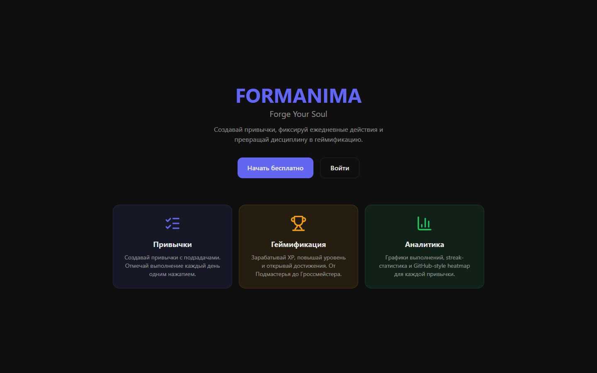

### 1.2. Регистрация

1. Нажмите «Регистрация».
2. Укажите имя, e-mail и пароль.
3. Подтвердите — будет создан аккаунт, и вы автоматически войдёте в систему.

E-mail должен быть уникальным; при попытке зарегистрироваться с уже существующим адресом появится сообщение об ошибке.

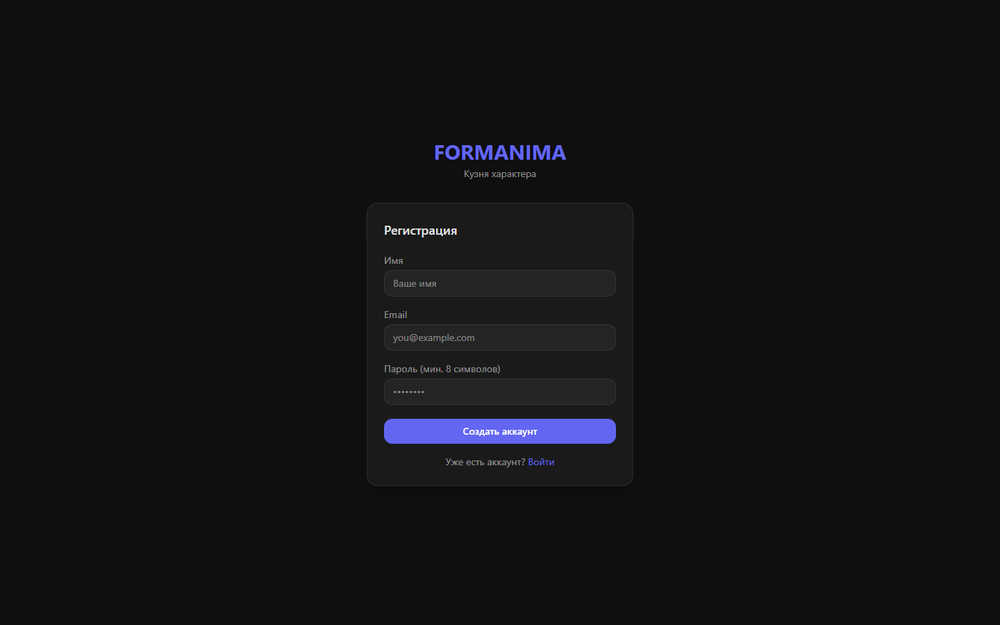

### 1.3. Вход

Если аккаунт уже есть, введите e-mail и пароль на странице входа. Сессия сохраняется между перезагрузками браузера; при истечении access-токена он автоматически обновляется без повторного входа.

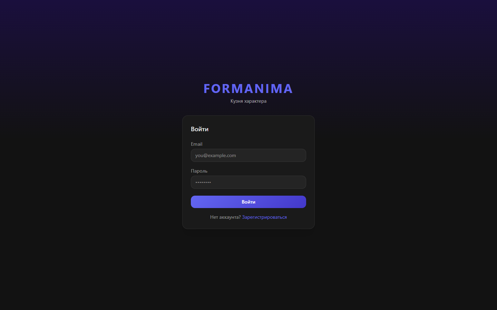

---

## 2. Дашборд

После входа открывается дашборд — основной экран ежедневной работы. Здесь отображаются:

- задачи и привычки на сегодня с возможностью отметить выполнение в один клик;
- виджет геймификации (текущий уровень, ранг, прогресс XP);
- мотивационные элементы и краткая сводка дня.

Отметка выполнения сразу начисляет XP и при необходимости разблокирует достижения (анимация «всплеска» XP).

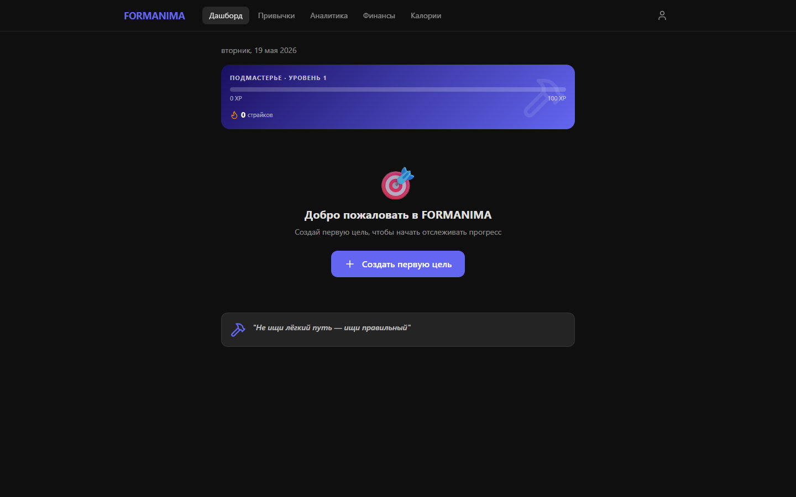

---

## 3. Привычки

Раздел «Привычки» (`/habits`) — список регулярных действий. Для каждой привычки можно:

- создать привычку с названием, описанием, категорией, частотой, цветом и иконкой;
- открыть детальную страницу (`/habits/:id`) с действиями (подзадачами) и стриком;
- архивировать привычку, когда она больше не нужна.

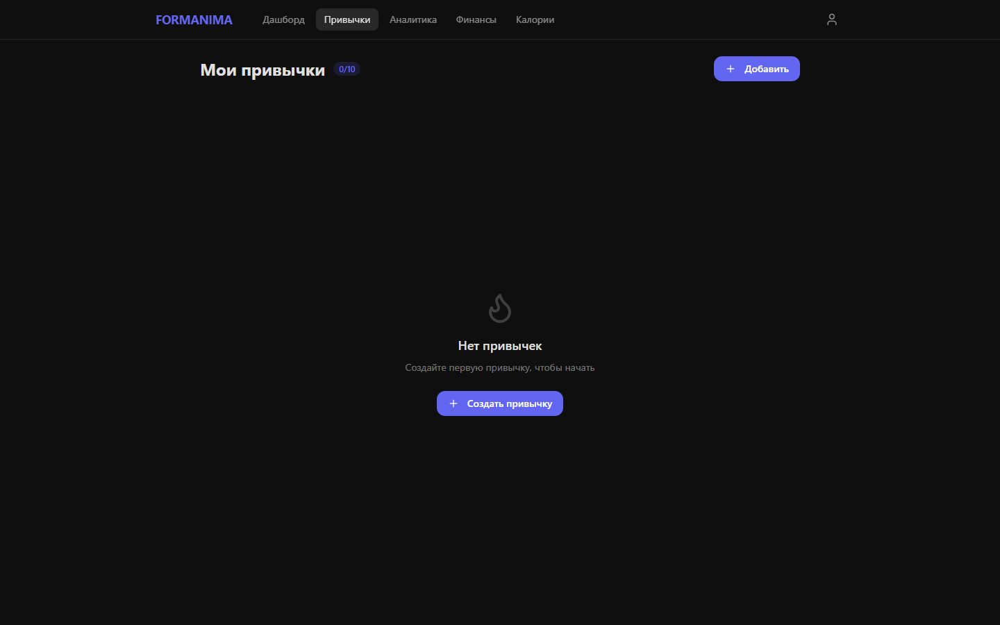

---

## 4. Цели

Раздел «Цели» (`/goals`) предназначен для более крупных задач разных типов (привычка, проект, питание, финансы, фитнес и др.). Возможности:

- создание цели с типом, категорией, целевым значением, частотой и дедлайном;
- **вехи (milestones)** — промежуточные шаги внутри цели, которые отмечаются по мере выполнения;
- ведение прогресса по датам с заметками;
- архивирование и восстановление целей.

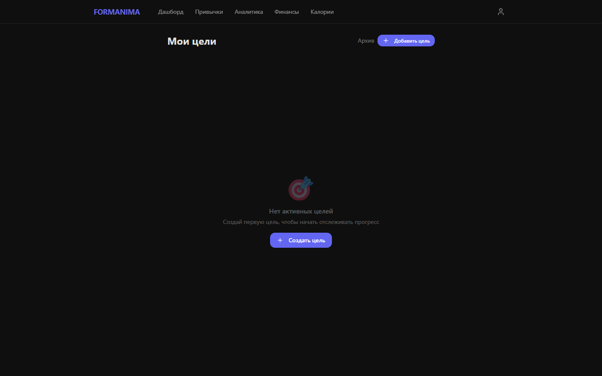

Открыв конкретную цель (`/goals/:id`), вы увидите её вехи и историю прогресса, сможете добавлять и удалять отметки за конкретные дни.

---

## 5. Финансы

Раздел «Финансы» (`/finance`) — учёт личных финансов:

- **Транзакции** — доходы и расходы по категориям с датой и описанием; поддерживаются повторяющиеся операции.
- **Бюджеты** — лимит по категории на месяц; приложение показывает, насколько он израсходован.
- **Накопительные цели** — целевая сумма с пополнениями; при достижении цели открывается достижение «Финансовый мастер».
- **Аналитика** — сводка за месяц (доходы, расходы, баланс), разбивка по категориям и тренды за несколько месяцев.

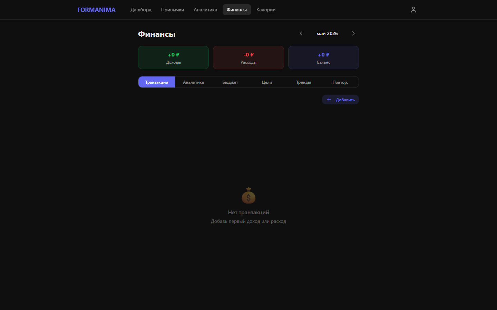

---

## 6. Калории

Раздел «Калории» (`/calories`) — дневник питания:

- добавление приёмов пищи (завтрак, обед, ужин, перекус) с указанием калорий и БЖУ;
- **профиль КБЖУ** — личные дневные нормы калорий, белков, жиров и углеводов;
- дневная и недельная сводки с сопоставлением фактического питания и норм.

7 дней подряд в пределах нормы калорий открывают достижение «Неделя в балансе».

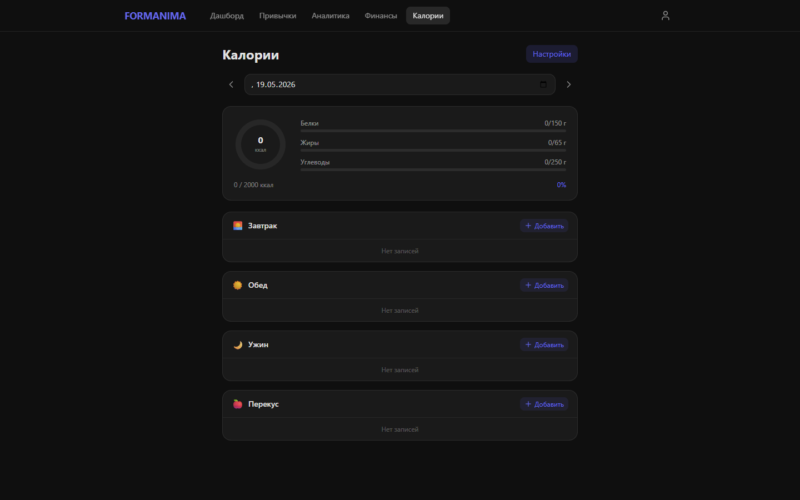

---

## 7. Аналитика

Раздел «Аналитика» (`/analytics`) визуализирует историю выполнения:

- **стрик** — текущая серия дней подряд;
- **heatmap** — тепловая карта активности за период (до 90–365 дней);
- общий обзор выполнения за выбранный интервал.

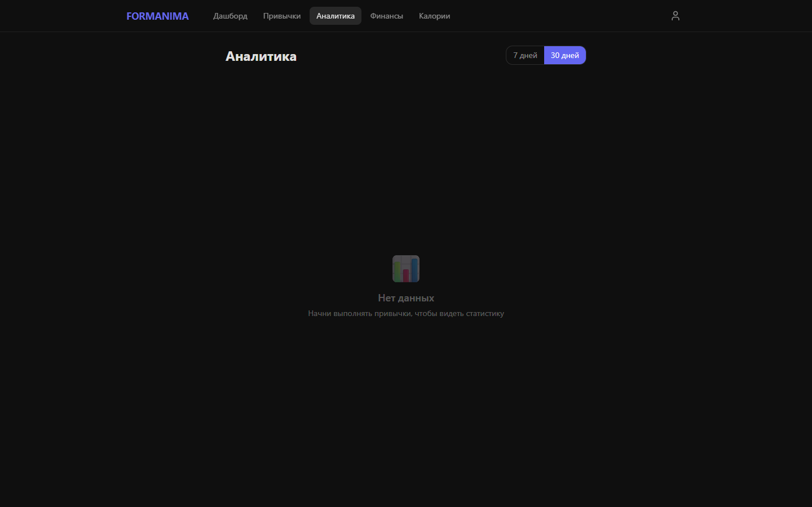

---

## 8. Достижения, уровни и ранги

Раздел «Достижения» (`/achievements`) показывает прогресс по 12 достижениям (ACH-001…ACH-012) и текущий статус геймификации.

**Как считается прогресс:**

- **XP** начисляется за выполнения, «идеальные дни» и разблокированные достижения.
- **Уровень** растёт по формуле `floor(√(XP / 100)) + 1`.
- **Ранг** зависит от суммарного числа выполнений: `apprentice` → `journeyman` (≥100) → `master` (≥500) → `grandmaster` (≥1500).

Полная таблица условий достижений приведена в [архитектурном документе](02-architecture.md#5-система-геймификации).

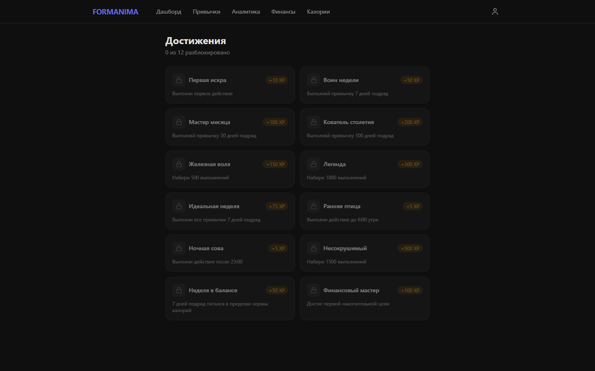

---

## 9. Профиль и настройки

Раздел «Профиль» (`/profile`) позволяет:

- изменить имя и данные аккаунта;
- переключить тему оформления (светлая/тёмная);
- выйти из системы.

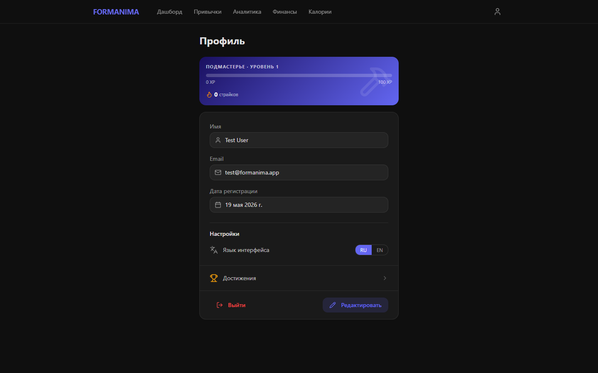

---

## 10. Администрирование

Раздел «Админ» (`/admin`) доступен только пользователям с ролью `admin`. Возможности:

- просмотр списка пользователей;
- блокировка и удаление пользователей (нельзя удалить собственный аккаунт);
- просмотр системной статистики.

Обычным пользователям этот раздел недоступен — при попытке открыть его происходит перенаправление на дашборд.

---

## 11. Частые вопросы (FAQ)

**Нужно ли устанавливать приложение?**
Нет, FORMANIMA работает в браузере. Приложение является SPA и поддерживает адаптивную вёрстку для мобильных и десктопных экранов.

**Сохранится ли вход после закрытия браузера?**
Да. Сессия восстанавливается автоматически; токены обновляются в фоне.

**В чём разница между «Привычками» и «Целями»?**
«Привычки» — простые регулярные действия с подзадачами. «Цели» — более универсальная сущность с типами, вехами и историей прогресса, в том числе связанная с финансами и питанием.

**Что даёт геймификация?**
Выполнение задач приносит XP, повышает уровень и ранг, открывает достижения — это поддерживает мотивацию к регулярности.

**Я забыл отметить выполнение за вчера — можно ли добавить задним числом?**
Да, прогресс по целям ведётся по датам, и отметку можно добавить или удалить за конкретный день на детальной странице цели.
