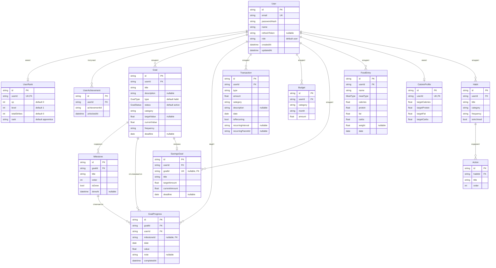

# Схема базы данных FORMANIMA (ERD)

Документ описывает структуру базы данных PostgreSQL 16, управляемой через Prisma ORM. Источник истины — [schema.prisma](../server/prisma/schema.prisma). Текстовое описание архитектуры данных см. в [02-architecture.md](02-architecture.md); здесь приведена ER-диаграмма и справочник по каждой модели с ограничениями.

Все идентификаторы — `cuid` (строки). Каскадное удаление настроено от `User` ко всем дочерним сущностям (`onDelete: Cascade`).

---

## ER-диаграмма

> Обозначения: `PK` — первичный ключ, `FK` — внешний ключ, `UK` — уникальное поле. `||--o{` — связь «один ко многим», `||--o|` — «один к одному (опционально)».

---

## Перечисления (enums)

| Enum | Значения |
|------|----------|
| `GoalType` | `habit`, `project`, `nutrition`, `finance`, `fitness`, `other` |
| `GoalStatus` | `active`, `completed`, `archived`, `paused` |
| `MealType` | `breakfast`, `lunch`, `dinner`, `snack` |

Роль пользователя хранится как строка (`User.role`, по умолчанию `"user"`), используемые значения — `user` и `admin`.

---

## Справочник по моделям

### User
Центральная сущность. Поля: `email` (уникальный), `passwordHash` (bcrypt), `name`, `refreshToken` (хеш refresh-токена), `role`, временные метки. Каскадно владеет всеми пользовательскими данными.

### UserRank
Состояние геймификации, **1:1** с User (`userId` уникален): `xp`, `level`, `totalStrikes`, `rank`.

### UserAchievement
Разблокированные достижения. Ограничение `@@unique([userId, achievementId])` исключает повторную выдачу одного достижения. Индекс по `userId`.

### Goal
Универсальная цель/привычка. Тип (`GoalType`) и статус (`GoalStatus`) — enum'ы; есть оформление (`color`, `icon`), целевое и текущее значение, частота, дедлайн. Индексы: `[userId, status]`, `[userId, type]`.

### Milestone
Веха внутри цели (`goalId`), с порядком `order` и флагом `isDone`. Индекс по `goalId`.

### GoalProgress
Запись прогресса по цели за дату. `milestoneId` опционален (отметка может относиться к вехе или к цели в целом). Индексы: `[userId, date]`, `[goalId, date]`. Из-за nullable `milestoneId` дедупликация записей выполняется на уровне сервиса (`findFirst`), а не уникальным индексом.

### SavingsGoal
Накопительная цель: `targetAmount`, `currentAmount`, опциональный `deadline`. Может быть связана с `Goal` через уникальный `goalId` (`onDelete: SetNull`). Индекс по `userId`.

### Transaction
Финансовая операция: `type` (доход/расход), `amount`, `category`, `date`, опциональное описание и поля повторения (`isRecurring`, `recurringInterval`, `recurringParentId`). Индексы: `[userId, date]`, `[userId, isRecurring]`.

### Budget
Месячный бюджет по категории. Ограничение `@@unique([userId, category, month])` — один бюджет на категорию в месяц. Индекс `[userId, month]`.

### FoodEntry
Запись дневника питания: `mealType` (enum), `calories`, БЖУ (`protein`, `fat`, `carbs`), опциональный `weight`, `date`. Индексы: `[userId, date]`, `[userId, mealType, date]`.

### CalorieProfile
Дневные нормы КБЖУ, **1:1** с User (`userId` уникален), значения по умолчанию: 2000 ккал / 150 Б / 65 Ж / 250 У.

### Habit, Action (legacy)
Старые модели простых привычек (`Habit`) с подзадачами (`Action`). Сохранены для совместимости с модулями `habits` и `stats`; новая функциональность реализована через `Goal`/`Milestone`/`GoalProgress`.
